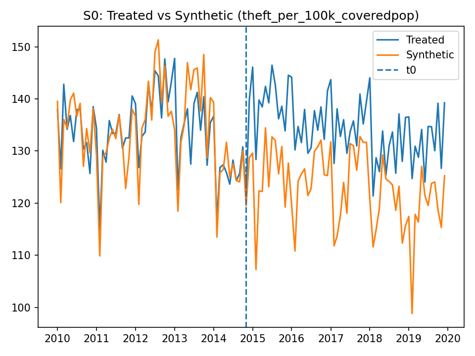
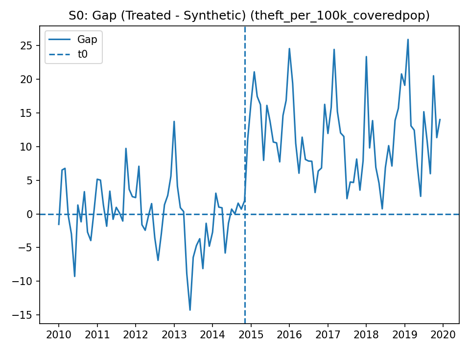
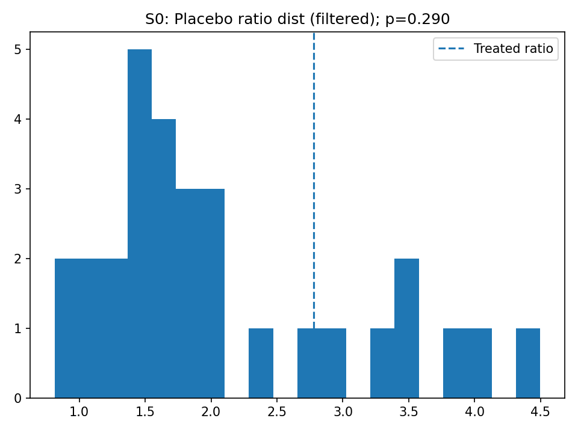
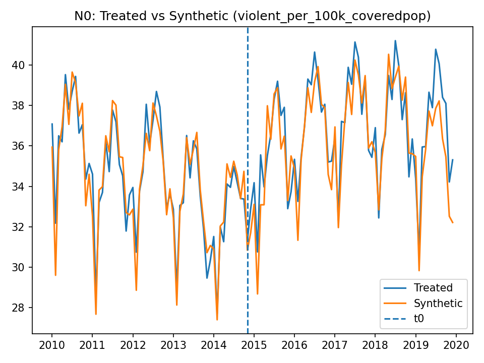
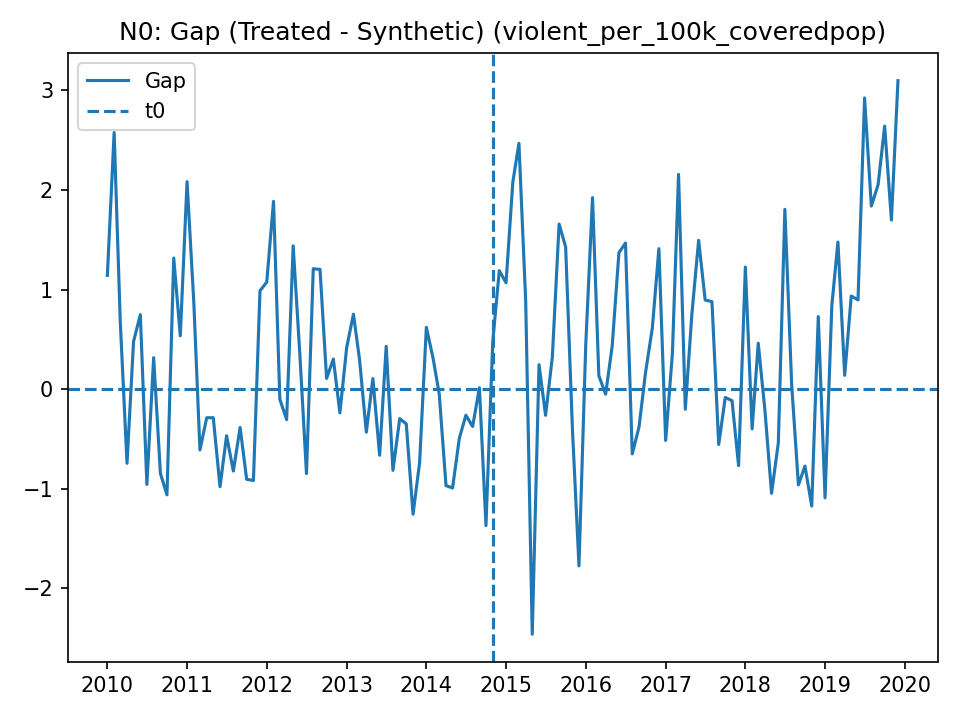

# Proposition 47 and California crime rates (2010–2024): a Synthetic Control case study

**Repo goal.** Estimate the causal effect of **California Proposition 47** (effective late 2014) on reported crime outcomes using monthly UCR-based state panels, with **Synthetic Control (SCM)** and placebo inference.

**Main takeaway.** The statewide SCM results are consistent with a **modest post‑Prop‑47 increase in reported larceny/theft**, but the effect is **not extreme** in magnitude and is **not statistically unusual** under standard in‑space placebo checks. Results for violent crime (negative control) show **no convincing post‑treatment divergence**. Together, this supports the interpretation that **statewide effects are small**, and that **localized urban effects (if present) may not be recoverable from statewide UCR aggregates**.

> **Note:** 2020–2021 data are impacted by COVID-era disruptions and reporting irregularities (see data QC notes). I report 2015–2019 as the most interpretable post‑treatment window and treat 2020+ as exploratory.

---

## 1. Background and motivation

Proposition 47 reclassified several theft- and drug-related felonies as misdemeanors for amounts under a threshold, with the intent to reduce incarceration and shift resources toward prevention and treatment. The policy became a focal point in debates about property crime, retail loss, and “urban retail decline.”

This project tests whether **statewide** reported crime rates in California diverged from a data-driven control group after Prop 47, using SCM (Abadie, Diamond, and Hainmueller 2010; Abadie 2021).

---

## 2. Data

### 2.1 Source and unit of analysis
- **Unit:** U.S. states (treated unit: **CA**; donors: other states with adequate reporting quality).
- **Time:** monthly, **2010–2024**.
- **Outcomes:**
  - `theft_per_100k_coveredpop` (primary)
  - `violent_per_100k_coveredpop` (negative control)

### 2.2 “Covered population” rates (handling missing agency reporting)
UCR participation varies by agency-month. To avoid spuriously deflating rates when some agencies do not report, outcomes are computed per **covered population** for each state-month (see `data_processing.md` for details).

### 2.3 Data quality exclusions
Several states/territories are excluded due to unstable or incomplete reporting (see `data_qc_report.md` for the rationale and thresholds).

---

## 3. Estimand and identification strategy

### 3.1 Potential outcomes and estimand
For treated unit CA and month \(t\), let:
 $Y_{CA,t}(1)$ be the observed outcome under Prop 47.
- $Y_{CA,t}(0)$ be the counterfactual outcome had Prop 47 not occurred.

Define the post window $\mathcal{T}_{post}$. The average treatment effect on the treated (ATT) is:

$$
ATT = \frac{1}{|\mathcal{T}_{post}|}\sum_{t \in \mathcal{T}_{post}} \left(Y_{CA,t}(1) - Y_{CA,t}(0)\right).
$$

### 3.2 SCM construction
SCM estimates the counterfactual as a convex combination of donor states:

$$
\hat{Y}_{CA,t}(0)=\sum_{j \in \mathcal{D}} w_j Y_{j,t},\quad w_j\ge 0,\ \sum_j w_j=1.
$$

Weights $w$ are chosen to minimize squared pre-treatment prediction error over a pre-period.

### 3.3 Inference via in-space placebos
I compute a common SCM diagnostic: **post/pre RMSPE ratio**, and compare the treated unit’s ratio to placebo ratios from reassigning treatment to each donor state. I also apply a standard filter that removes placebo runs with much worse pre-fit than the treated (Abadie et al. 2010).

---

## 4. Design choices

### 4.1 Treatment timing
Baseline treatment start is **2014-11-01** (Prop 47 takes effect in late 2014). Robustness includes a shifted timing (2015-01-01).

### 4.2 Windows used in the extended panel
- **Pre:** from `pre_start` through $t_0$ (exclusive)
- **Post 1 (most interpretable):** $t_0$ through **2019-12** (pre-COVID)
- **COVID:** 2020–2021 (reported but treated cautiously)
- **Post 2:** 2022–2024 (exploratory due to missingness and structural breaks)

---

## 5. Results

### 5.1 Primary outcome: theft per 100k covered population (SCM, baseline spec)

**Figure 1.** CA vs synthetic control (theft), baseline timing (S0).

**Figure 2.** Gap (treated − synthetic), baseline timing (S0).

Qualitatively:
- Pre‑period fit is reasonable (the series track fairly closely).
- After Prop 47, CA is often **above** the synthetic control, generating a **positive gap** in much of 2015–2019.
- The magnitude appears “moderate” rather than dramatic at the statewide level.

### 5.2 Placebo evidence (baseline spec)

**Figure 3.** Distribution of placebo post/pre RMSPE ratios (filtered); treated ratio shown as dashed line.

Interpretation:
- CA’s post/pre RMSPE ratio is not an extreme outlier relative to donors.
- For the 2010–2019 baseline run, the filtered placebo p-value is approximately **0.29** (i.e., ~29% of filtered placebos have ratio ≥ treated).

### 5.3 Summary numbers (2010–2024 extension)

The table below summarizes the extended 2010–2024 run for baseline theft (S0) and the violent-crime negative control (N0), using a tighter placebo pre-fit filter (`pre_rmspe_mult=1.5`).

- **S0 (theft)**: average gap in **2015–2019** ≈ **11.68** (per 100k covered pop). Placebo p-value (ratio, post1) ≈ **0.421**.
- **S0 (theft)**: in **2022–2024**, average gap ≈ **3.44**, with placebo p-value (ratio, post2) ≈ **0.842** (not suggestive of a distinctive divergence).
- **N0 (violent)**: placebo p-values do not provide evidence of a clear Prop‑47‑specific effect on violence in the pre‑COVID window.

---

## 6. Negative control: violent crime per 100k covered population

**Figure 4.** CA vs synthetic control (violent), baseline timing (N0).

**Figure 5.** Gap (violent), baseline timing (N0).

Interpretation:
- Pre‑period fit is strong.
- Post‑treatment gaps do not show the same persistent positive divergence seen in theft.
- This pattern is consistent with “Prop 47 affects property theft more than violent crime,” which aligns with PPIC’s 2018 assessment in broad direction (see References).

---

## 7. Discussion: what these results mean (and what they do **not** mean)

### 7.1 Why the statewide effect can look small even if urban anecdotes are strong
These results can coexist with visible “retail distress” anecdotes (especially post‑2020) for several reasons:
1. **Geographic heterogeneity:** Prop 47 effects may be concentrated in a subset of large urban cores; statewide aggregation dilutes localized changes.
2. **Outcome mismatch:** public discourse often focuses on retail loss (shrink), downtown foot-traffic collapse, and business exits—these are not the same as reported UCR theft counts.
3. **COVID-era structural break:** 2020–2021 saw major shifts in mobility, policing, reporting, and economic activity. SCM built on 2010–2014 relationships may extrapolate poorly through that break.
4. **Reporting artifacts:** UCR coverage, agency participation, and classification changes can move measured rates independent of underlying crime.

### 7.2 What we can reasonably claim from this project
- **Directional finding:** A modest, sustained positive gap in theft post‑2014 at the statewide level.
- **Strength of evidence:** Placebo tests do **not** suggest the post/pre RMSPE ratio is unusual; inference is therefore **weak-to-moderate**, not “slam dunk.”
- **Negative control:** Violent crime does not show a compelling Prop‑47‑specific divergence under the same design.

### 7.3 What we cannot claim from this project
- That Prop 47 “caused” the 2023–2024 retail and downtown dynamics in SF (this requires city/county-level outcomes, better retail proxies, and careful handling of post‑COVID breaks).
- That Prop 47 had no effect at all. SCM can miss real effects when (i) effects are heterogeneous or (ii) measurement/reporting is noisy.

---

## 8. Limitations and next steps

### 8.1 Key limitations
- **Measurement:** UCR reported crime is not “true crime.”
- **Interference/spillovers:** Inter-state spillovers are possible (e.g., migration, cross-border activity), though likely limited for this application.
- **Design sensitivity:** SCM results depend on donor pool, pre-fit, and the assumption that the synthetic combination remains valid post‑treatment.
- **COVID:** A major confounder and structural break for 2020+.

### 8.2 Practical next steps (optional)
If continuing the research (not required to close the repo):
- Add a **separate SF‑county/city** analysis using outcomes with better post‑2020 coverage and clearly defined reporting rules.
- Explore alternative identification (e.g., **Synthetic DiD**) with sensitivity checks—useful when SCM pre-fit is imperfect.
- Incorporate retail proxies (business openings/closures, foot traffic, sales tax receipts) if reliable sources can be obtained.

---

## 9. Reproducibility

Recommended repo layout:
- `notebooks/` — primary replication notebook(s)
- `data/raw/` — raw parquet inputs or pointers (if too large)
- `data/processed/` — processed state-month panels (if size permits)
- `figures/` — saved plots referenced here
- `tables/` — summary CSV outputs
- `environment.yml` — pinned environment

---

## References

- Abadie, Alberto, Alexis Diamond, and Jens Hainmueller. 2010. “Synthetic Control Methods for Comparative Case Studies: Estimating the Effect of California’s Tobacco Control Program.” *Journal of the American Statistical Association* 105(490): 493–505. DOI: 10.1198/jasa.2009.ap08746.
- Abadie, Alberto. 2021. “Using Synthetic Controls: Feasibility, Data Requirements, and Methodological Aspects.” *Journal of Economic Literature* 59(2): 391–425. DOI: 10.1257/jel.20191450.
- Bird, Mia, Magnus Lofstrom, and Brandon Martin. 2018. *The Impact of Proposition 47 on Crime and Recidivism.* Public Policy Institute of California (PPIC).
